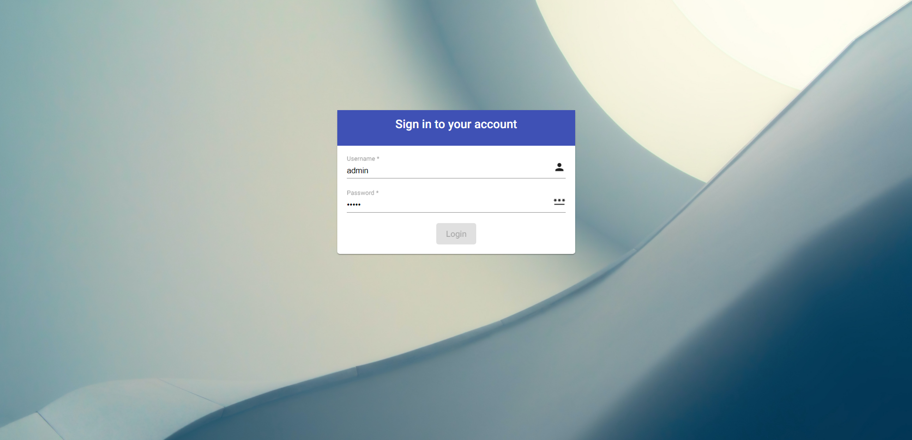

# Keycloak Login Theme Angular

This is a custom login theme generator for Keycloak built with Angular 13 & Angular Material.

## Generate a theme
1. Run `ng build` for creating a build prod distribution.
2. After `ng build` is finished it will run `postbuild` script.
   1. The script will create a new folder "$keycloak_theme_build" with all the files by keycloak theme directory structure.
   2. Move the contents of "$keycloak_theme_build" directory to your Keycloak theme folder (inside Keycloak). 

### Example login page in Keycloak

### Requirements
Tested with the following Keycloak versions:
* [16.1.0](https://hub.docker.com/layers/jboss/keycloak/16.1.0/images/sha256-6ecb9492224c6cfbb55d43f64a5ab634145d8cc1eba14eae8c37e3afde89546e?context=explore)

Tested with the following Angular versions:
* [Angular 13](https://github.com/angular/angular-cli)

## Run Angular project instructions

## Development server

Run `ng serve` for a dev server. Navigate to `http://localhost:4200/`. The app will automatically reload if you change any of the source files.

## Code scaffolding

Run `ng generate component component-name` to generate a new component. You can also use `ng generate directive|pipe|service|class|guard|interface|enum|module`.

## Build

Run `ng build` to build the project. The build artifacts will be stored in the `dist/` directory.

## Running unit tests

Run `ng test` to execute the unit tests via [Karma](https://karma-runner.github.io).
## Running end-to-end tests

Run `ng e2e` to execute the end-to-end tests via a platform of your choice. To use this command, you need to first add a package that implements end-to-end testing capabilities.

## Further help

To get more help on the Angular CLI use `ng help` or go check out the [Angular CLI Overview and Command Reference](https://angular.io/cli) page.
